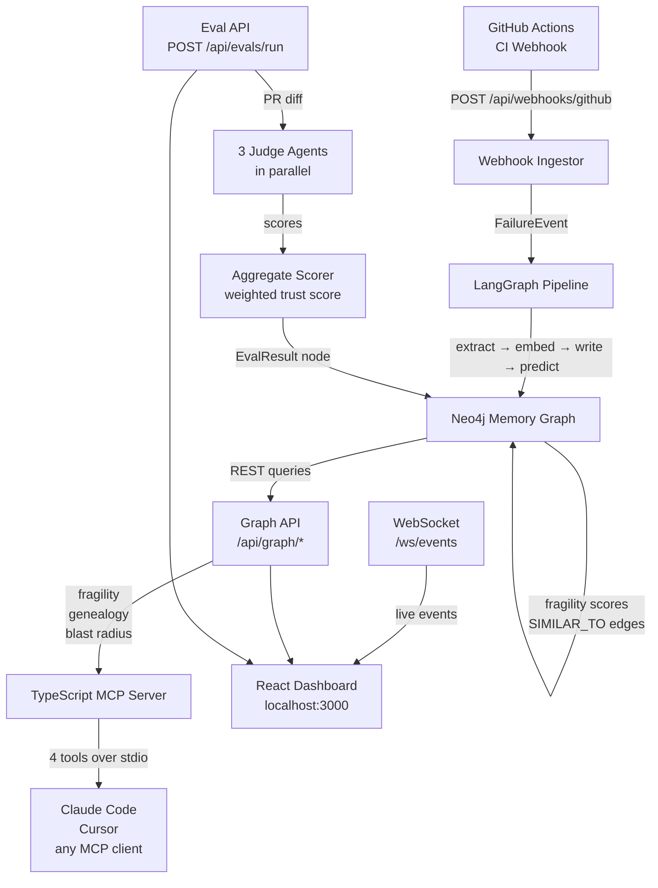
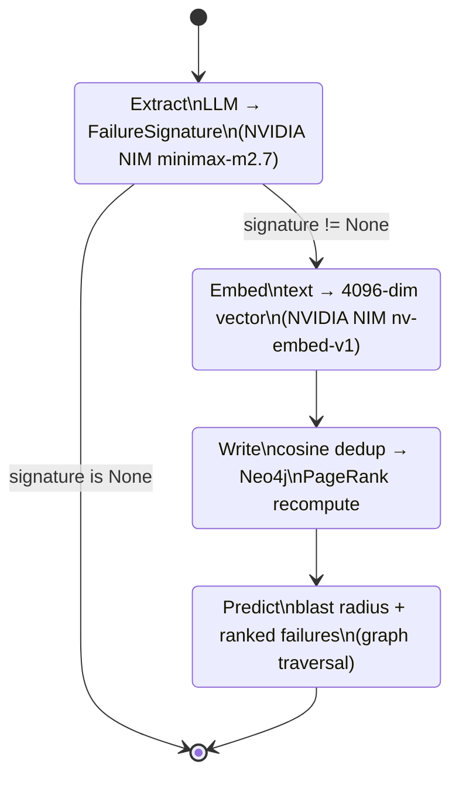
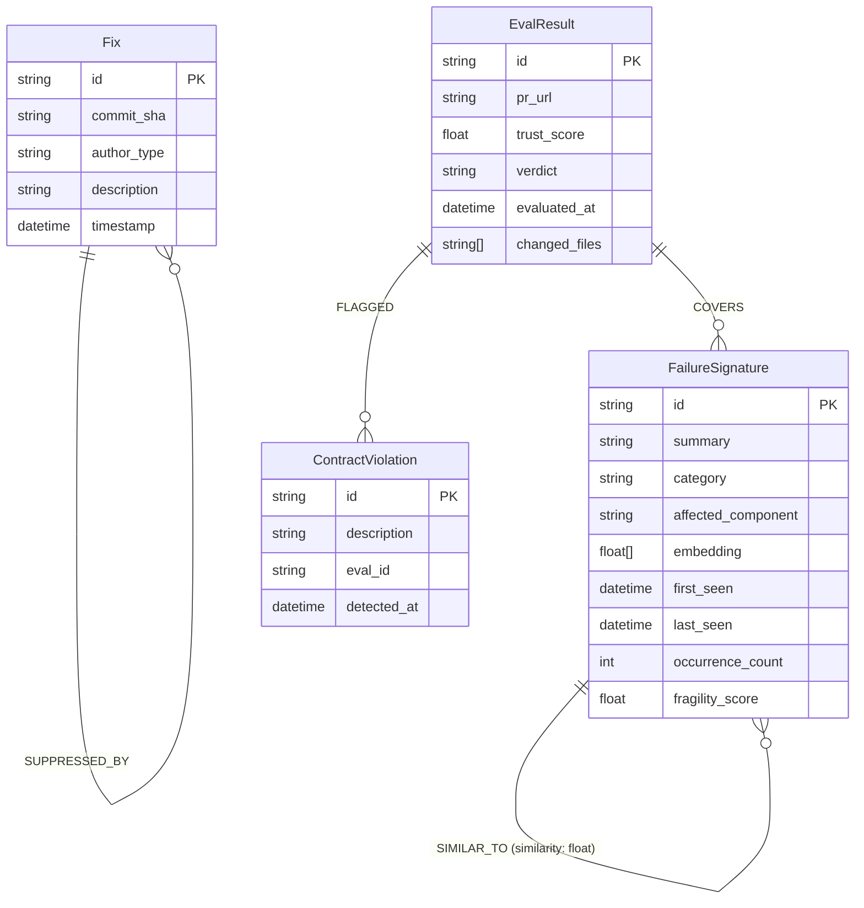
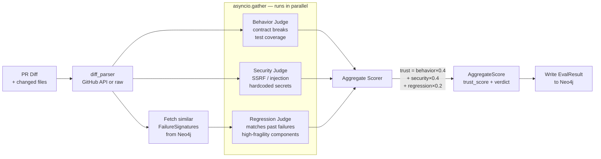
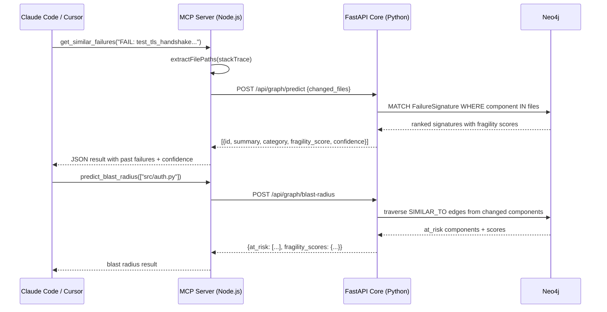
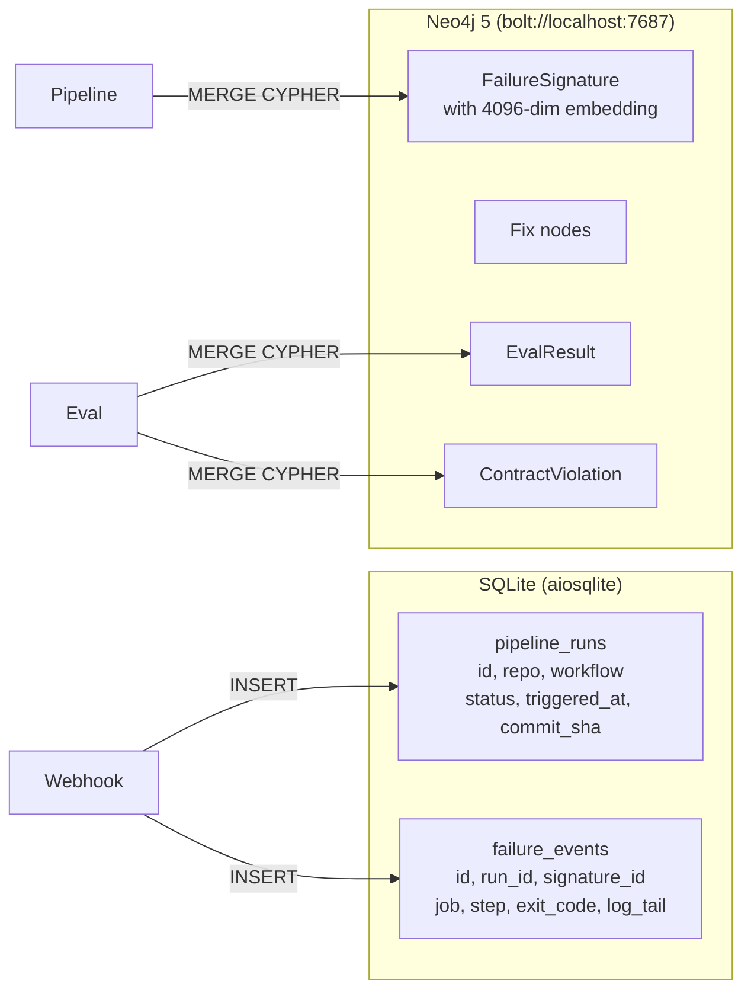
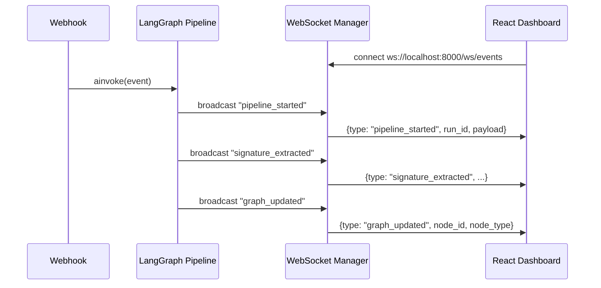

# PhoenixOS — Architecture

## System Overview

PhoenixOS has three independent layers that compose into a single system. Each layer can be understood and tested on its own.



---

## Layer 1 — Ingest Pipeline (LangGraph)

Every CI failure triggers this 4-node state machine.



**State object (`PhoenixState`):**
| Field | Type | Set by |
|---|---|---|
| `event` | `FailureEvent` | Webhook ingestor |
| `signature` | `FailureSignature \| None` | `extract` node |
| `predictions` | `list[dict]` | `predict` node |
| `at_risk` | `list[str]` | `predict` node |
| `fragility_scores` | `dict[str, float]` | `predict` node |

**Deduplication thresholds:**
- `≥ 0.92` cosine → `EXACT` (increment occurrence_count, no new node)
- `0.80 – 0.92` → `SIMILAR` (new node + `SIMILAR_TO` edge)
- `< 0.80` → `NEW` (isolated new node)

---

## Layer 2 — Neo4j Memory Graph

### Node Types



### Relationship Types

| Relationship | From → To | Meaning |
|---|---|---|
| `SIMILAR_TO` | FailureSignature → FailureSignature | Cosine similarity 0.80–0.92 |
| `SUPPRESSED_BY` | Fix → Fix | Deeper fix suppresses shallower one |
| `FLAGGED` | EvalResult → ContractViolation | Behavioral issue found in eval |
| `COVERS` | EvalResult → FailureSignature | Eval touched this component |
| `RECURS_IN` | FailureSignature → FailureSignature | Same failure recurred (future) |

### Fragility Score

PageRank over the `SIMILAR_TO` edge graph, normalized by graph size:

```
raw_scores = nx.pagerank(G, weight="similarity", alpha=0.85)
fragility  = min(1.0, raw_score × N/2)
```

A node scoring 2× the graph average → fragility 1.0 (red). Average node → ~0.5 (amber).

---

## Layer 3 — Eval Mesh (3 Judge Agents)



**Verdict rules:**
- `trust ≥ 0.7` → **pass**
- `0.4 ≤ trust < 0.7` → **warn**
- `trust < 0.4` → **block**
- Security judge flags SSRF or injection → **block** regardless of weighted score

---

## Layer 4 — MCP Integration



**4 tools registered via `.mcp.json`:**

| Tool | Core endpoint | Purpose |
|---|---|---|
| `get_fragility_score` | `GET /api/graph/fragility?component=` | Score + trend for a file |
| `get_similar_failures` | `POST /api/graph/predict` | Past failures matching a stack trace |
| `get_fix_genealogy` | `GET /api/graph/genealogy/{fix_id}` | Fix chain depth + suppression warning |
| `predict_blast_radius` | `POST /api/graph/blast-radius` | At-risk components from changed files |

---

## Data Persistence



SQLite stores raw pipeline metadata (immutable audit log). Neo4j stores the semantic graph (mutable — scores recomputed on every new write).

---

## WebSocket Live Feed



Events: `pipeline_started`, `signature_extracted`, `graph_updated`, `eval_complete`

---

## Runtime Topology

```
┌─────────────────────────────────────────────────────────┐
│  Developer machine / CI                                  │
│                                                          │
│  ┌─────────────────────────┐    ┌─────────────────────┐ │
│  │  FastAPI (port 8000)    │    │  React Vite (3000)  │ │
│  │  PYTHONPATH=packages    │    │  /api → :8000 proxy │ │
│  │  uv run uvicorn ...     │    │  /ws  → :8000 proxy │ │
│  └────────────┬────────────┘    └────────────┬────────┘ │
│               │                              │          │
│  ┌────────────▼────────────┐    ┌────────────▼────────┐ │
│  │  Neo4j 5 (port 7687)    │    │  MCP Server         │ │
│  │  Docker container       │    │  node dist/index.js │ │
│  │  neo4j:5-community      │    │  stdio transport    │ │
│  └─────────────────────────┘    └─────────────────────┘ │
└─────────────────────────────────────────────────────────┘
```

---

## Key Design Decisions

| Decision | Choice | Why |
|---|---|---|
| Graph database | Neo4j 5 | Native graph traversal for SIMILAR_TO and SUPPRESSED_BY chains; Cypher is expressive for genealogy recursion |
| LLM / embeddings | NVIDIA NIM | Single API key for both streaming LLM and 4096-dim embeddings; no OpenAI dependency |
| Orchestrator | LangGraph | Built-in conditional edges (skip embed/write if extraction failed); state is typed via TypedDict |
| Dedup | Cosine similarity | Embedding-space dedup finds semantically identical failures with different error messages |
| Fragility scoring | PageRank × N/2 | PageRank naturally rewards nodes with many similar failures linking to them; N/2 normalization makes scores human-readable |
| MCP transport | stdio | Simplest transport; works with Claude Code and Cursor without a separate HTTP server |
| Frontend | React + Vite | No SSR needed; Vite's dev proxy eliminates CORS config; simpler than Next.js for a monitoring dashboard |
| Metadata DB | SQLite | Append-only audit log; zero ops; aiosqlite keeps it async |
